# Graph Neural Networks with External Knowledge for Visual Dialog

Author: Ioannis Kalogeropoulos

**NOTE: For a more detailed description of the task, the implementation, the preprocessing of ConceptNet, the experiments and the relevant references please refer to the published [Thesis](http://artemis.cslab.ece.ntua.gr:8080/jspui/handle/123456789/18425?locale=en)**.

Contents:
  * [About](#About)
  * [Visual Dialog](#visual-dialog)
  * [Problem Formulation](#problem-formulation)
  * [Baseline Model](#baseline-model)
  * [Proposed Method](#proposed-method)
  * [Experiments](#experiments)
  * [Conclusions](#conclusions)

## About

In this work we study the effectiveness of Graph Neural Networks on the task of [Visual Dialog](https://visualdialog.org/).

Towards achieving interesting architectures and great results, we experiment on two axes:

1. **Fusion Methods**: The fusion method used to combine the three different modalities is a fundamental design choice towards the achievement of better results.

2. **External Knowledge encoding**: We examine the use of one or multiple types of relations of the knowledge graph as well as different methods of aggregating the external information.

Our experiments surpass our state-of-the-art baselines, demonstrating that the External Knowledge is beneficial for the overall performance, especially using simpler GNN layers for its encoding. Moreover, we demonstrate this impact by using two types of decoders. The consistency of the results using both decoders highlights the impact of the different encoders. Finally, from our results, we come to the conclusion that the simplest models with less parameters were able to perform better towards encoding the External Knowledge Graph.

## Visual Dialog

### The task
The task of [Visual Dialog](https://visualdialog.org/) requires an AI agent to hold a meaningful dialog with humans in natural, conversational language about visual content. Given as an input an image, a dialog history and a question referring to the image, the desired model is expected to combine the question with the scene shown in the image, extract any useful information from the dialog history and come up with the an accurate response.

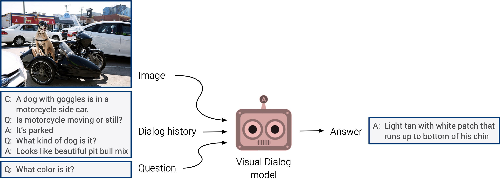

### Compared to VQA
One could compare the visual dialog task, with the more popular task of [Visual Question Answering](https://openaccess.thecvf.com/content_iccv_2015/html/Antol_VQA_Visual_Question_ICCV_2015_paper.html), which describes the task of providing an image to the model and asking one question. However, the concept of the dialog, having 10 rounds instead of just one and therefore expecting that the model will also take into account the history of the dialog, is not the only significant difference between the VisDial and the above datasets.

One key differentiation is that in VQA, subjects saw an image while asking questions about it. However, this tends to introduce a bias, when generating the dataset. Specifically, a vast amount of questions is questioning the existence of objects that are actually found in the picture. This allows language-only models to perform remarkably well on VQA. Interestingly, for a specific type of questions in the VQA dataset starting with ‘Do you see a . . . ’, blindly answering ‘yes’ without reading the rest of the question or looking at the associated image results in an average VQA accuracy of 87%. In VisDial, questioners have not access to the image and, as a result, this bias is reduced. Finally, another significant difference between Visual Dialog and VQA is that in the former the agent is primed with a caption for the image and questions often refer to objects referenced in it, while in the latter task there is no image caption. As a result, the two tasks are not similar even on the first round of the dialog.

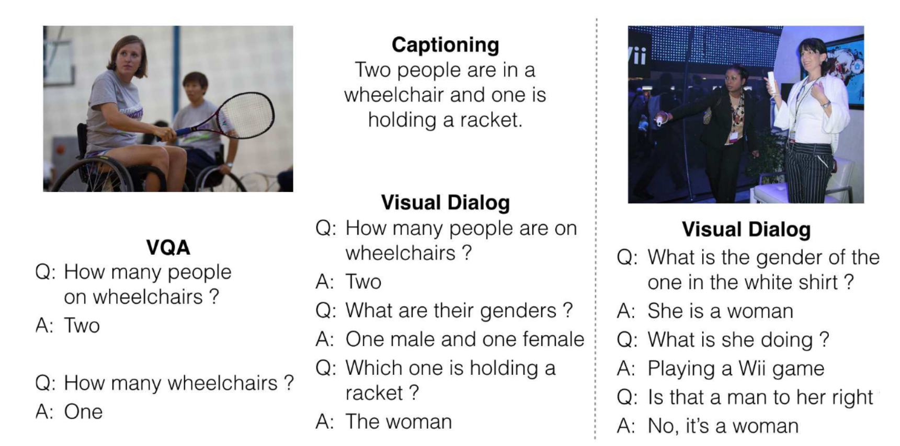

The common points the Visual Dialog and VQA share, as well as their differences are grouped in the below tables:

<table>
 <tr>
   <th>Common points </th><th>Different Points</th>
 </tr>
<tr>
 <td>
  <table>
    <tr>
     <td>Question over an Image</td>
    </tr>
    <tr>
     <td>Agent has to combine image and text modalities</td>
    </tr>
    <tr>
     <td>Images from COCO dataset</td>
    </tr>
  </table>
</td>
<td>
   <table>
   <tr>
     <th>Visual Dialog</th>
     <th>Visual Question Answering</th>   
   </tr>
    <tr>
     <td>Image and Caption as initial input</td>
     <td>Image as input</td>  
    </tr>
    <tr>
     <td>10 rounds of questions</td>
      <td>Only one question</td> 
    </tr>
    <tr>
     <td>Questioners do not see the image</td>
      <td>Questioners see the image</td>
    </tr>
  </table>
</td>
 </tr> 
</table>

## Problem Formulation
In the Visual Dialog task, an agent is required to reason based on a given image **I** , caption **C**, dialogue history **Ht = {C, (Q1, A1), ..., (Qt−1, At−1)}**, and the current question **Qt** at round t. The task is to rank a list of 100 candidate answers **A = {A1, A2, ..., A100}** and return the best answer **At** to **Qt** . 

Towards approaching this problem we adapt an Encoder - Decoder architecture, as shown in the figure below:

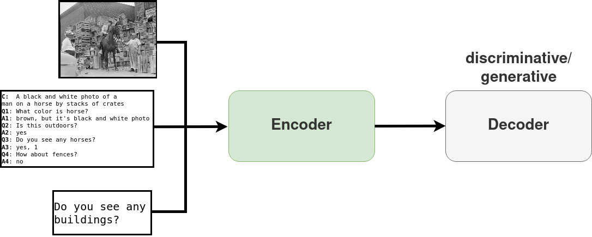

## Baseline Model
As our baseline model we select the approach proposed in [1](#jiang2020kbgn). The Knowledge-Bridge Graph Network (KBGN) framework constructs two fully connected graphs, one for each modality:

1. Vision graph:
 * Node features: features of the visual entities, detected by a pre-trained **[Faster-RCNN](https://github.com/peteanderson80/bottom-up-attention)**
 * Edge features: the visual relationships between nodes, extracted by **[Large-Scale-VRD](https://github.com/jz462/Large-Scale-VRD.pytorch)**
2. Text graph:
 * Node features: each question-answer pair of the dialog history Ht encoded by an **bi-LSTM**, which takes as input the
concatenation of GloVe and ELMo word embeddings.
 * Edge features: concatenation of nodes’ representations

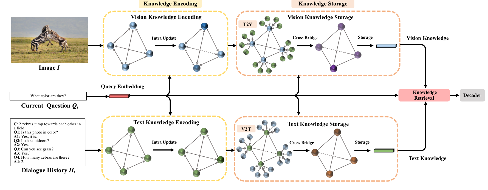

Jiang el al. [1](#jiang2020kbgn) then proposed three different modules to encode the information and fuse the two modalities, resulting in one encoded representation of the whole input, which will then be fed into the decoder. The three modules are briefly described below:

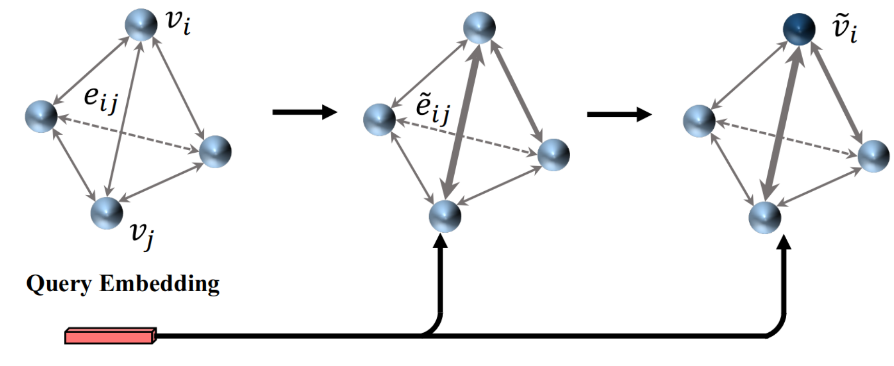
1. **Knowledge Encoding**:
   * Applied independently to both modalities. 
   * Encodes the visual and textual information from the input using the current question as a guidance
   * Aims to capture the text and the vision relations **within** each modality
  
  

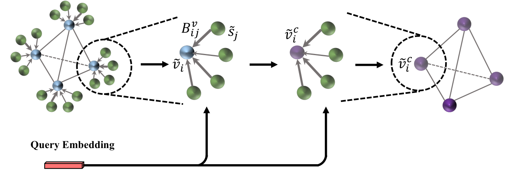
2. **Knowledge Storage**:
   * Enriches the text modality with image and vice versa.
   * Each node (center node) from each modality, is enriched by every node (cross node) of the other modality.
   * Apply gate operation on node level
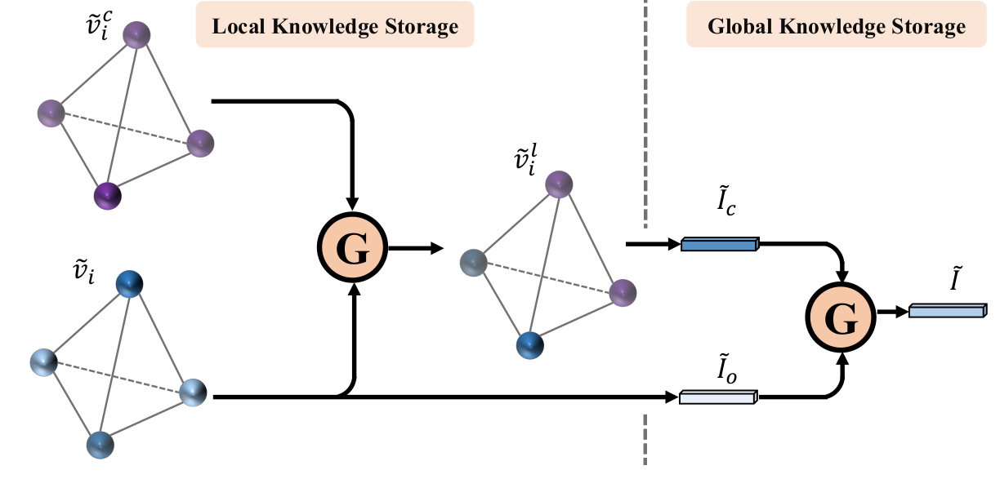
   * Extract Graph Embeddings
   * Gate operation on graph level
   * *Result*: Compute the final representation of the enriched modality.
  
  
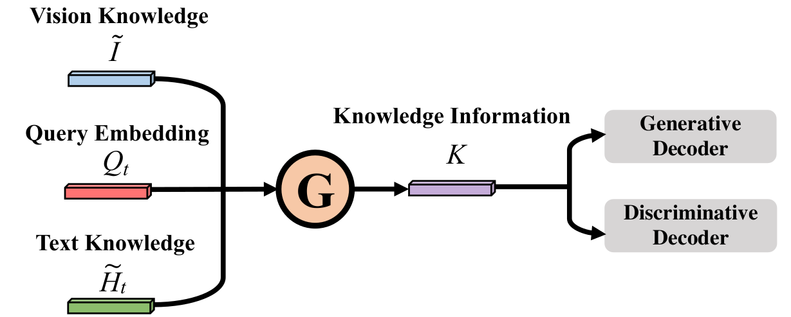
3. **Knowledge Retrieval**:
   * Adaptively select relative information from vision and text knowledge for the final answer based on the current question, using a final gate operation.
 
 
 

_For a more detailed description of the baseline model, please refer to the original [publication](#jiang2020kbgn)._

## Proposed Method
Utilizing the fusion methods of the two modalities described in the above section, we attempt to exploit external knowledge gathered from the popular knowledge graph [Concept-Net ](https://conceptnet.io/). For this purpose a **third graph**, called **External Knowledge Graph**, was introduced in the model. Experiments were conducted on both how to better exploit the External Knowledge Graph and on the final fusion of the three modalities. In the below subsections the details of the implemented model are presented.

The core procedure can be decomposed into three main modules, similarly to the baseline. Specifically, after encoding the information within each of the modalities, we enrich the Vision and the Text utilizing information derived from all the others. <u>The result of it is two types of enriched information for the Vision and for the Text modality</u>. Then, we combine the two enriched knowledges for each modality resulting in a complete knowledge for each modality. Finally, we combine the current Question with the Vision and the Text knowledge and feed the result to the decoder. An abstract scheme of our model is shown below:

  

### Graph Construction

The graphs representing the Vision  and the Text  modalities are constructed and initialized as in the baseline model. 

The External Knowledge graph  has significant differences with the Vision and Text graphs, that lead to the need of a different encoding. Specifically, it is a _subset of the Concept-Net knowledge graph_, where each node is a _concept_ present in the Dialog History or in the Current Question. As a result, it is a **highly sparse graph** in contrast to the vision and text graphs, which are fully connected. Moreover, each node is initialized with the corresponding **[numberbatch embeddings](https://github.com/commonsense/conceptnet-numberbatch)**. Finally, as described later in the preprocessing of the ConceptNet, there are multiple types of relationships present in the External Knowledge graph and taking all of them into account or not is a crucial decision, as shown by the experiments that followed. 

_For more information about the preprocessing of the ConceptNet see the relevant section in the Appendix._

The final proposed architecture is shown below:

  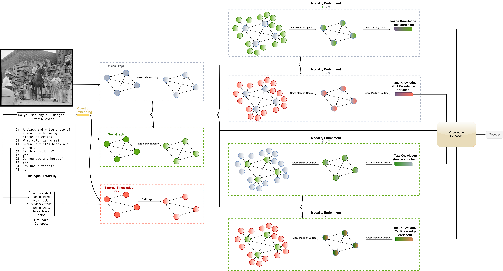

### Intra-modal encoding

  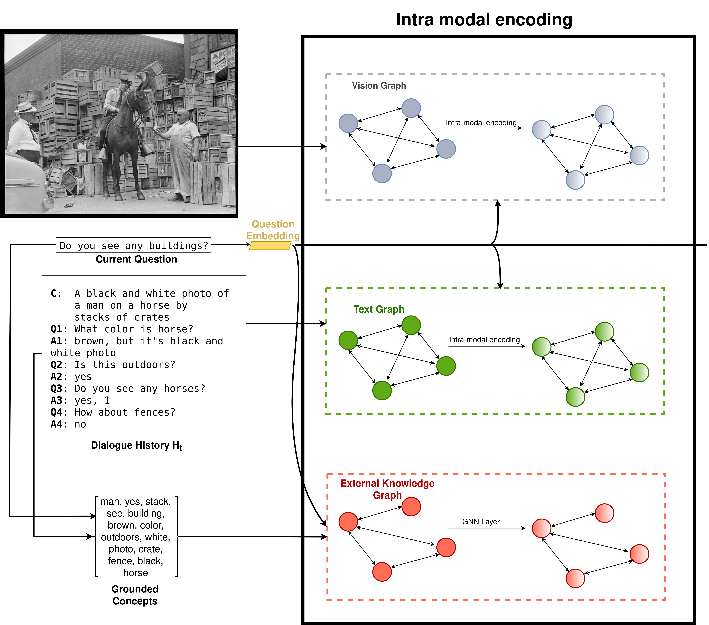

Similarly to the baseline, the vision and text graph encoding is applied independently for the two modalities. Using the question as a guidance for the encoding, we are able to capture the text and the vision relations within each modality. The encoding of the Vision Graph is as follows:

1. Relation update:
<!-- KE 1 -->

  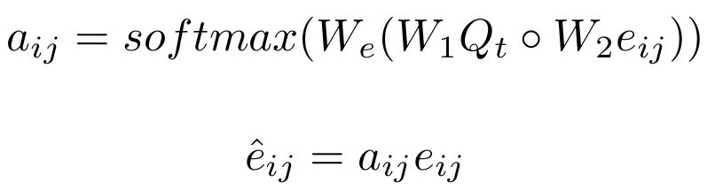

2. Node update:
<!-- KE 2 -->

  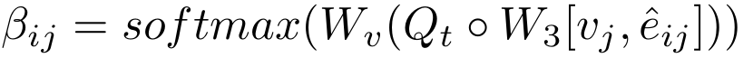

<!-- KE 3 -->

  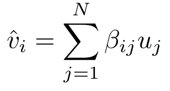

For the intra-modal encoding of the External Knowledge graph we experimented with various popular GNN layers. Specifically, several experiments were conducted, that demonstrated the effect of taking into account the relation types as well as applying self attention to the nodes. The encoding of the External Knowledge Graph will result in the external knowledge information that together with the vision and text knowledge will be fed into the next modules.

#### GNNs for external Graph
The following GNN variants were utilized to encode the external Graph:

<ul>
 <li> <big>GCN (KBGN-Ext-GCN-CON-Q, KBGN-Ext-GCN-S-Q) </big>

  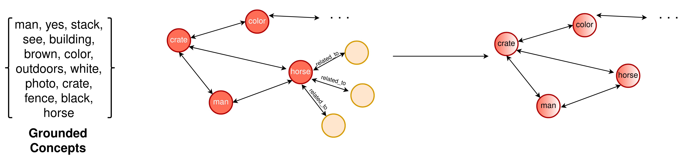
  
  </li>
 <li> <big>R-GCN (KBGN-Ext-RGCN)</big>

  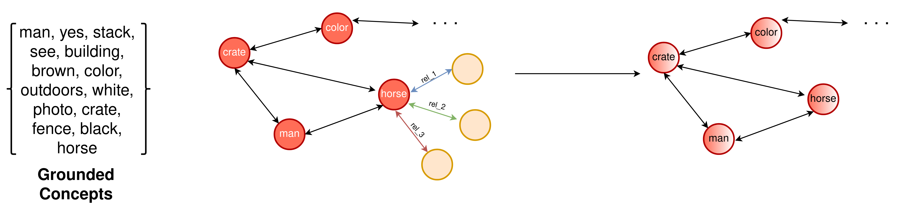
  
  </li>
 <li> <big>GAT (KBGN-Ext-GAT, KBGN-Ext-GAT-Q)</big>

 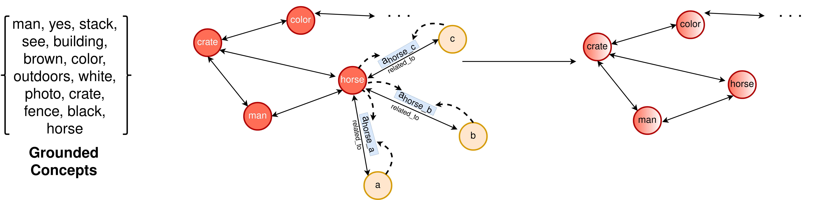
  
  
  </li>
 <li> <big>custom Message Passing method (KBGN-Ext-MessagePassing)</big>

  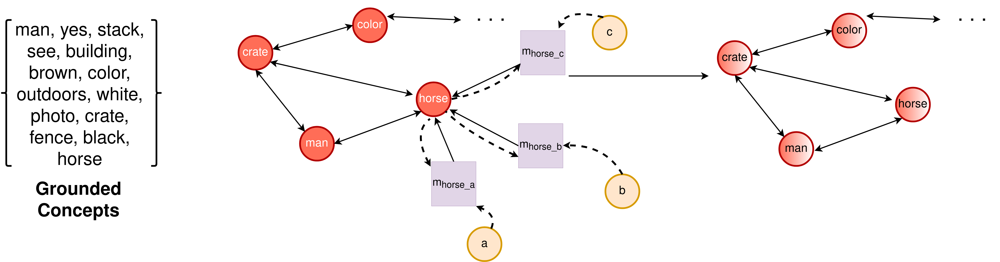
  
  </li>
</ul>

### Modality Enrichment

  

The modality enrichment module was derived from the Knowledge Storage module of the baseline model. Specifically, we introduce an abstract of the specific module, called _Modality\_enrichment_, using center and cross nodes. The former belong to the modality that is being enriched, while the latter to the modality that is used to enrich the former. 

Assuming we want to enrich modality  M1, represented by graph  G1 : (V1 , E1 ) with modality  M2, represented by graph  G2 : (V2 , E2 ), the following procedure is followed:

<ol type="1">
<li>Construct M2-to-M1 GNN, where each intra-modal center node v1i is connected with all the inter-modal cross nodes v2ϵV2 by edges Bij, provided as Bij = \[v1i , v2j \], where iϵ\[0, |V1| − 1\] and jϵ\[0, |V2 | − 1\]</li>
 <li>
 Update the edges (bridges), under the guidance of the current question Qt :
<!-- ME 1 -->

  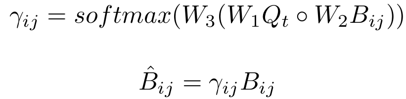

</li>
<li>Update the center nodes as:
<!-- ME 2 -->

  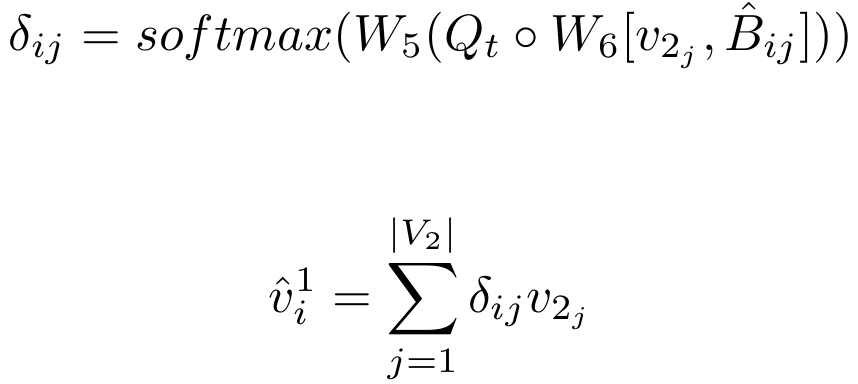

 
As shown in the below figure, the nodes of G2 graph (brown nodes) are used to enrich the information
of G1 ’s nodes (blue).

  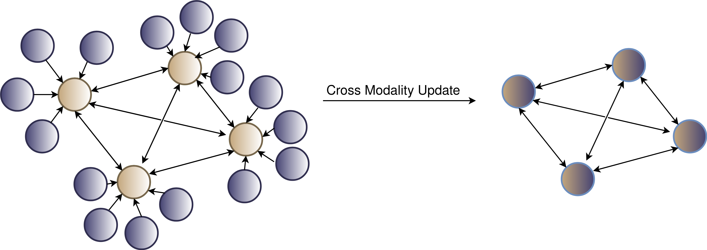

 </li>
 
<li> Apply a gate operation between the input center nodes and the updated center nodes obtained in the previous step, inter-dependence-aware local knowledge v&#770;i1 :
<!-- ME 3 -->

  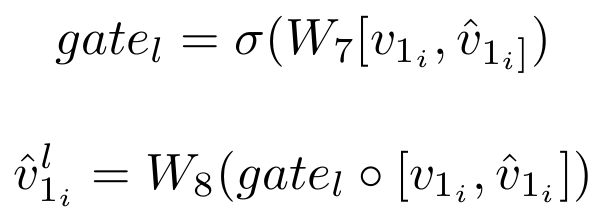

 </li>
<li> Obtain a global intra-modal knowledge information, by extracting a graph embedding of the updated graph produced in the knowledge encoding module:

<!-- ME 4 -->

  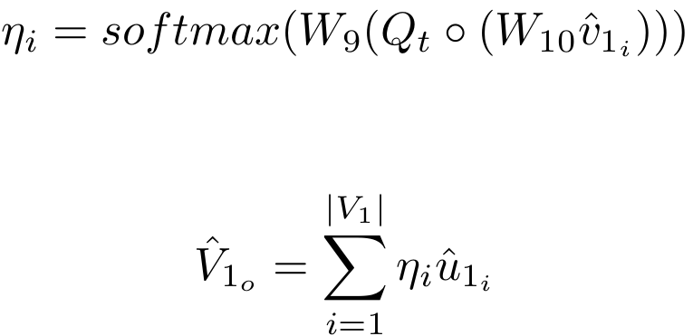

 </li>

 <li> Obtain the cross global intra-modal knowledge I&#770;c, by extracting a graph embedding of the updated M2-to-M1 graph, with the guidance of the current question:

<!-- ME 5 -->

  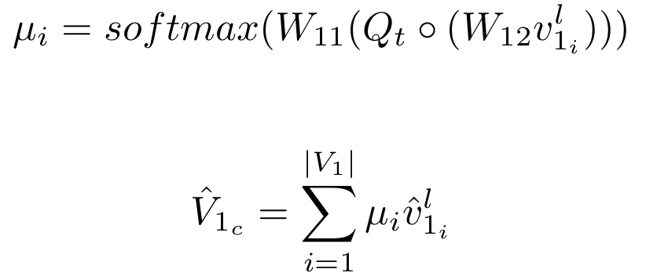

 </li>
<li> Finally, obtain the global knowledge, using by a gate operation:
<!-- ME 6 -->

  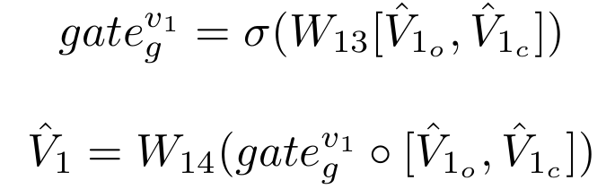

 

  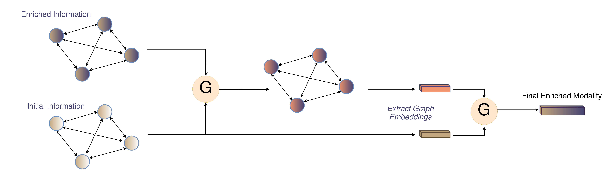

 </li>
</ol>

By the end of the above procedure we will have obtained the knowledge relevant to the M1 modality enriched by the M2 modality, which is represented by V&#770;1 .

Using the above procedure, we employ four Modality enrichment modules:

* Modality_Enrichment(Vision ,Text ) 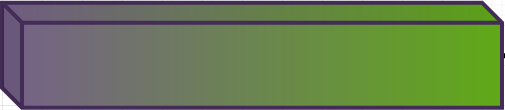 
* Modality_Enrichment(Vision ,External Knowledge) 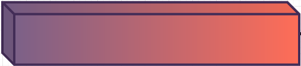 
* Modality_Enrichment(Text ,Vision ) 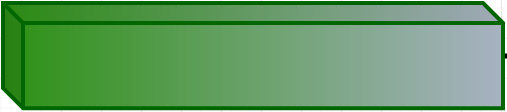 
* Modality_Enrichment(Text ,External Knowledge) 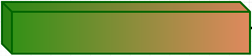 

### Knowledge Selection

  

The Knowledge Selection module is the original module from the baseline, modified in order to adaptively select relative information from the four sources of knowledge; vision enriched by text I&#770;T , vision enriched by external knowledge I&#770;E ,text enriched by vision T&#770;I and text enriched by external knowledge T&#770;E . Specifically, we extract a global vision knowledge, enriched by the text and the external knowledge modality and a global text knowledge, enriched by the vision and the external knowledge modality. Finally, we select the relevant information, with a method similar to the one in the baseline model:

  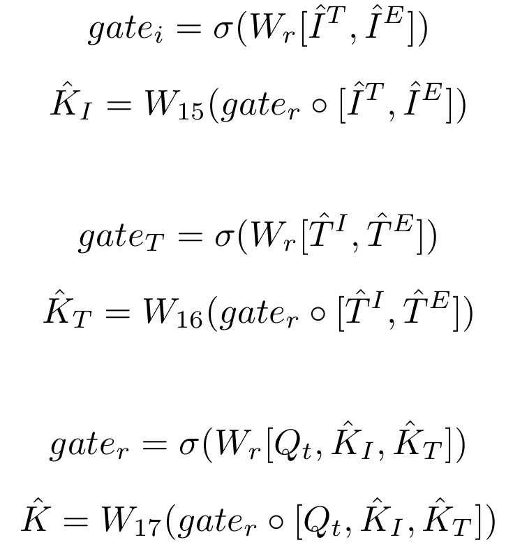

The Knowledge Selection is shown in the figure below:

  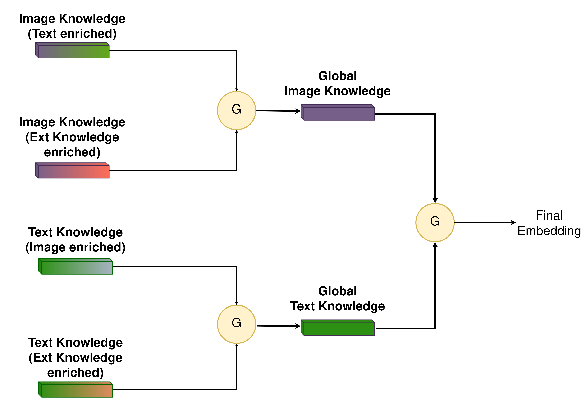

### Decoders
As proposed by Das et al. [[2](#das2017visual)], encoder’s result is fed into one of the two decoders:
<ul>
 <li> <b>Discriminative decoder</b>:
  <ul>
   <li>Ranks a set of 100 candidate answers.</li>
   <li>During training, we maximize the log- likelihood of the correct option.</li>
  </ul>
 </li>
 
 <li> <b>Generative decoder</b>:
  <ul>
   <li>Outputs probability distribution over the vocabulary at each decoding step.</li>
   <li>During training, we maximize the log-likelihood of the ground truth answer sequence given its corresponding encoded representation.</li>
  </ul>
 </li>
 </ul>

## Experiments

In the below tables KBGN-Ext-GCN-CON-Q concatenates the question with the node embeddings for the encoding of the External Knowledge graph, while KBGN-Ext-GCN-S-Q uses the question to generate coefficients for the nodes of the graph. The models KBGN-Ext-GAT and KBGN-Ext-GAT-Q correspond to the models that employ a GAT module, without and with the question respectively. By KBGN-Ext-RGCN we denote the model that utilizes an RGCN module and by KBGN-Ext-MessagePassing the one that used a custom Message Passing method. Finally, KBGN-Numb refers to a model exactly as the baseline, but using the Numberbatch embeddings instead of the concatenation of GloVe and ELMo embeddings.

**For a more detailed description of the experiments please refer to the published [Thesis](http://artemis.cslab.ece.ntua.gr:8080/jspui/handle/123456789/18425?locale=en)**.

### Discriminative Decoder

  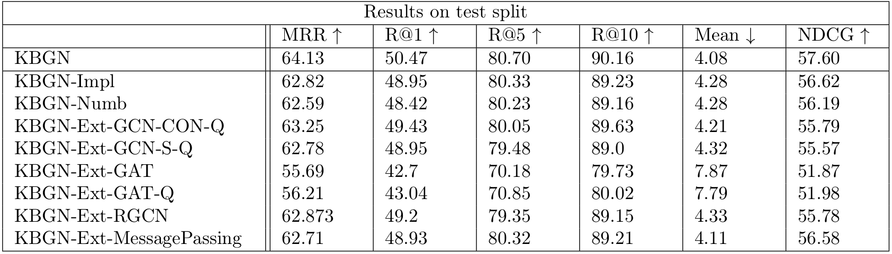

### Generative Decoder

  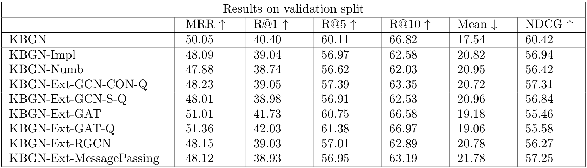

### Results Discussion
<ul>
 <li>Results comparable to the implemented baseline</li>
<li>Consistency of the results in both decoders, which highlights the impact of the different encoders.</li>
<li>KBGN-Ext-GCN-CON-Q and KBGN-Ext-RGCN achieve the best results, surpassing the implemented by us baseline.</li>
<li>KBGN-Message-Passing performs worse than the baseline</li>
<li>KBGN-Numb achieves the worst results</li>
</ul>

## Conclusions
From the above results, we are eble to draw the below conclusions:

<ul>
 <li>Introducing External Knowledge seems to boost the results.</li>
 <li>Simpler GNN layers, GCN and R-GCN, performed better.</li>
 <li>Bigger and more complex layers KBGN-Message-Passing had a negative impact to the results.</li>
 <li>The bad performance of KBGN-Numb demonstrates the impact of the External Knowledge Graph, which feeds the model with more information.</li>
 
</ul>

 
@inproceedings{jiang2020kbgn,
  title={Kbgn: Knowledge-bridge graph network for adaptive vision-text reasoning in visual dialogue},
  author={Jiang, Xiaoze and Du, Siyi and Qin, Zengchang and Sun, Yajing and Yu, Jing},
  booktitle={Proceedings of the 28th ACM International Conference on Multimedia},
  pages={1265--1273},
  year={2020}
}

 
@inproceedings{das2017visual,
  title={Visual dialog},
  author={Das, Abhishek and Kottur, Satwik and Gupta, Khushi and Singh, Avi and Yadav, Deshraj and Moura, Jos{\'e} MF and Parikh, Devi and Batra, Dhruv},
  booktitle={Proceedings of the IEEE conference on computer vision and pattern recognition},
  pages={326--335},
  year={2017}
}
